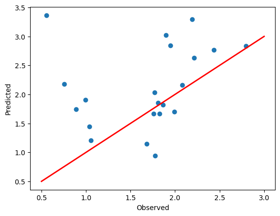

```python
import os
print(os.getcwd())
```

    C:\Users\Haris
    


```python
os.chdir(r"D:\Genetics\R\ML")
```


```python
print(os.getcwd())
```

    D:\Genetics\R\ML
    


```python
import pandas as pd
import numpy as np
import matplotlib.pyplot as plt
import shap
```


```python
from sklearn.model_selection import train_test_split
```


```python
from sklearn.linear_model import LinearRegression
```


```python
from sklearn.tree import DecisionTreeRegressor
```


```python
from sklearn.ensemble import RandomForestRegressor
```


```python
import xgboost as xgb
```


```python
data = pd.read_csv("soybean_data.csv")
```


```python
data.describe()
```


<div>
<style scoped>
    .dataframe tbody tr th:only-of-type {
        vertical-align: middle;
    }

    .dataframe tbody tr th {
        vertical-align: top;
    }

    .dataframe thead th {
        text-align: right;
    }
</style>
<table border="1" class="dataframe">
  <thead>
    <tr style="text-align: right;">
      <th></th>
      <th>Rep</th>
      <th>DFI</th>
      <th>DF50</th>
      <th>DFC</th>
      <th>NBP</th>
      <th>StmDia</th>
      <th>PH</th>
      <th>PPP</th>
      <th>Bmass</th>
      <th>HSW</th>
      <th>...</th>
      <th>EX_1011</th>
      <th>CV_1509</th>
      <th>CV_2209</th>
      <th>CV_2809</th>
      <th>CV_0610</th>
      <th>CV_1310</th>
      <th>CV_2010</th>
      <th>CV_2710</th>
      <th>CV_0311</th>
      <th>CV_1011</th>
    </tr>
  </thead>
  <tbody>
    <tr>
      <th>count</th>
      <td>102.000000</td>
      <td>102.000000</td>
      <td>102.000000</td>
      <td>102.000000</td>
      <td>102.000000</td>
      <td>102.000000</td>
      <td>102.000000</td>
      <td>102.000000</td>
      <td>102.000000</td>
      <td>102.000000</td>
      <td>...</td>
      <td>102.000000</td>
      <td>102.000000</td>
      <td>102.000000</td>
      <td>102.000000</td>
      <td>102.000000</td>
      <td>102.000000</td>
      <td>102.000000</td>
      <td>102.000000</td>
      <td>102.000000</td>
      <td>102.000000</td>
    </tr>
    <tr>
      <th>mean</th>
      <td>2.000000</td>
      <td>29.009804</td>
      <td>32.617647</td>
      <td>37.470588</td>
      <td>9.290196</td>
      <td>6.777863</td>
      <td>61.574510</td>
      <td>66.050490</td>
      <td>125.594118</td>
      <td>14.610784</td>
      <td>...</td>
      <td>0.278717</td>
      <td>1.753630</td>
      <td>2.764926</td>
      <td>3.804731</td>
      <td>3.314365</td>
      <td>4.167194</td>
      <td>4.056231</td>
      <td>3.165479</td>
      <td>1.743235</td>
      <td>0.960686</td>
    </tr>
    <tr>
      <th>std</th>
      <td>0.820529</td>
      <td>0.814413</td>
      <td>0.975381</td>
      <td>1.157891</td>
      <td>1.467436</td>
      <td>1.298952</td>
      <td>9.521614</td>
      <td>14.702004</td>
      <td>51.357629</td>
      <td>2.677553</td>
      <td>...</td>
      <td>0.121785</td>
      <td>0.769012</td>
      <td>0.809242</td>
      <td>1.135790</td>
      <td>1.118413</td>
      <td>1.121759</td>
      <td>0.994902</td>
      <td>0.886033</td>
      <td>0.908283</td>
      <td>0.684744</td>
    </tr>
    <tr>
      <th>min</th>
      <td>1.000000</td>
      <td>27.000000</td>
      <td>31.000000</td>
      <td>35.000000</td>
      <td>7.000000</td>
      <td>3.004000</td>
      <td>43.600000</td>
      <td>36.000000</td>
      <td>12.500000</td>
      <td>9.700000</td>
      <td>...</td>
      <td>0.131742</td>
      <td>0.443817</td>
      <td>1.003153</td>
      <td>1.337975</td>
      <td>1.059545</td>
      <td>2.076899</td>
      <td>2.288284</td>
      <td>1.861397</td>
      <td>0.468160</td>
      <td>0.332963</td>
    </tr>
    <tr>
      <th>25%</th>
      <td>1.000000</td>
      <td>28.000000</td>
      <td>32.000000</td>
      <td>37.000000</td>
      <td>8.200000</td>
      <td>6.127000</td>
      <td>54.800000</td>
      <td>55.100000</td>
      <td>90.125000</td>
      <td>12.825000</td>
      <td>...</td>
      <td>0.183411</td>
      <td>1.203811</td>
      <td>2.184968</td>
      <td>2.842947</td>
      <td>2.564262</td>
      <td>3.410434</td>
      <td>3.410330</td>
      <td>2.587163</td>
      <td>1.050226</td>
      <td>0.622339</td>
    </tr>
    <tr>
      <th>50%</th>
      <td>2.000000</td>
      <td>29.000000</td>
      <td>33.000000</td>
      <td>37.000000</td>
      <td>9.000000</td>
      <td>6.500000</td>
      <td>60.200000</td>
      <td>65.800000</td>
      <td>120.000000</td>
      <td>13.550000</td>
      <td>...</td>
      <td>0.244174</td>
      <td>1.579689</td>
      <td>2.666884</td>
      <td>3.857346</td>
      <td>3.269451</td>
      <td>4.079626</td>
      <td>3.897997</td>
      <td>2.950270</td>
      <td>1.525221</td>
      <td>0.743559</td>
    </tr>
    <tr>
      <th>75%</th>
      <td>3.000000</td>
      <td>29.000000</td>
      <td>33.000000</td>
      <td>39.000000</td>
      <td>10.200000</td>
      <td>7.392500</td>
      <td>65.750000</td>
      <td>74.900000</td>
      <td>150.000000</td>
      <td>16.400000</td>
      <td>...</td>
      <td>0.361904</td>
      <td>2.255685</td>
      <td>3.258637</td>
      <td>4.490365</td>
      <td>3.932669</td>
      <td>4.824682</td>
      <td>4.541233</td>
      <td>3.533969</td>
      <td>2.364711</td>
      <td>1.087887</td>
    </tr>
    <tr>
      <th>max</th>
      <td>3.000000</td>
      <td>31.000000</td>
      <td>35.000000</td>
      <td>39.000000</td>
      <td>14.800000</td>
      <td>11.202000</td>
      <td>90.400000</td>
      <td>105.200000</td>
      <td>340.000000</td>
      <td>21.200000</td>
      <td>...</td>
      <td>0.642936</td>
      <td>3.999792</td>
      <td>4.915623</td>
      <td>6.372969</td>
      <td>6.552499</td>
      <td>7.770032</td>
      <td>7.434490</td>
      <td>6.147461</td>
      <td>4.817494</td>
      <td>4.792502</td>
    </tr>
  </tbody>
</table>
<p>8 rows × 68 columns</p>
</div>


```python
print(data)
```

                Gen  Rep FC  DFI  DF50  DFC   NBP  StmDia    PH   PPP  ...  \
    0        ORP-22    1  P   29    32   37   7.4   5.700  64.6  45.0  ...   
    1        ORP-23    1  P   31    33   39  10.4   6.400  54.6  67.4  ...   
    2        ORP-24    1  P   30    33   39   9.4   5.700  66.2  36.0  ...   
    3        ORP-25    1  P   29    31   37   8.4   7.200  53.6  52.8  ...   
    4        ORP-26    1  P   30    33   39  10.4   6.200  57.4  76.8  ...   
    ..          ...  ... ..  ...   ...  ...   ...     ...   ...   ...  ...   
    97   Faisal-Soy    3  P   29    33   39  10.8   7.130  64.0  70.8  ...   
    98      PRGB-57    3  P   29    33   39  10.2   5.778  61.0  50.8  ...   
    99      PGRB-55    3  P   28    32   39   9.2   6.016  66.6  78.4  ...   
    100     PGRB-70    3  P   27    31   37  10.4   7.272  67.0  69.2  ...   
    101   GPNARC-14    3  P   29    33   38  10.8   7.370  59.2  91.4  ...   
    
          EX_1011   CV_1509   CV_2209   CV_2809   CV_0610   CV_1310   CV_2010  \
    0    0.151511  1.757255  3.257916  4.126754  3.344351  4.263771  4.138655   
    1    0.202278  1.579601  3.480845  4.763208  3.494335  4.651155  4.475253   
    2    0.202018  2.598486  4.572911  5.554318  4.327419  5.230024  4.970533   
    3    0.168530  2.454450  3.991085  4.978773  4.022206  4.722671  4.526325   
    4    0.171283  1.627913  2.981558  3.854758  3.145771  4.257073  4.058309   
    ..        ...       ...       ...       ...       ...       ...       ...   
    97   0.282171  1.332954  2.496589  2.906299  3.266821  4.015304  3.946058   
    98   0.244997  1.328437  2.306674  2.475580  2.978808  3.450257  3.203941   
    99   0.177540  1.689590  2.766967  3.099731  3.013365  3.645897  3.467811   
    100  0.193419  1.554618  2.546825  3.227506  2.870115  3.586250  3.389564   
    101  0.131742  1.846826  2.871853  3.974923  3.316907  4.075564  3.510507   
    
          CV_2710   CV_0311   CV_1011  
    0    2.870336  0.807194  0.438474  
    1    3.363684  1.230867  0.648995  
    2    3.732367  1.211177  0.749246  
    3    3.363825  1.026127  0.632540  
    4    2.964672  1.024545  0.589450  
    ..        ...       ...       ...  
    97   3.484737  2.238173  0.978340  
    98   2.742859  1.345403  0.922867  
    99   2.634469  1.044831  0.632200  
    100  2.729717  1.115424  0.660924  
    101  2.584147  0.711290  0.457928  
    
    [102 rows x 70 columns]
    


```python
# Define all features except PlotY as independent variables
features = data.columns.tolist() 
features.remove("Yield")
features.remove("Gen")
features.remove("Rep")
features.remove("FC")
features.remove("PlotY")
```


```python
# Define the target variable
target = "PlotY"
```


```python
# Split the data into training and testing sets (80% train, 20% test)
X_train, X_test, y_train, y_test = train_test_split(data[features], data[target], test_size=0.2, random_state=42)
```


```python
print(features)
```

    ['DFI', 'DF50', 'DFC', 'NBP', 'StmDia', 'PH', 'PPP', 'Bmass', 'HSW', 'SYP', 'DM', 'VR_1509', 'VR_2209', 'VR_2809', 'VR_0610', 'VR_1310', 'VR_2010', 'VR_2710', 'VR_0311', 'VR_1011', 'RV_1509', 'RV_2209', 'RV_2809', 'RV_0610', 'RV_1310', 'RV_2010', 'RV_2710', 'RV_0311', 'RV_1011', 'RE_1509', 'RE_2209', 'RE_2809', 'RE_0610', 'RE_1310', 'RE_2010', 'RE_2710', 'RE_0311', 'RE_1011', 'ND_1509', 'ND_2209', 'ND_2809', 'ND_0610', 'ND_1310', 'ND_2010', 'ND_2710', 'ND_0311', 'ND_1011', 'EX_1509', 'EX_2209', 'EX_2809', 'EX_0610', 'EX_1310', 'EX_2010', 'EX_2710', 'EX_0311', 'EX_1011', 'CV_1509', 'CV_2209', 'CV_2809', 'CV_0610', 'CV_1310', 'CV_2010', 'CV_2710', 'CV_0311', 'CV_1011']
    


```python
# Create and train the Linear Regression model
lin_reg = LinearRegression()
lin_reg.fit(X_train, y_train)
```


<style>#sk-container-id-1 {color: black;background-color: white;}#sk-container-id-1 pre{padding: 0;}#sk-container-id-1 div.sk-toggleable {background-color: white;}#sk-container-id-1 label.sk-toggleable__label {cursor: pointer;display: block;width: 100%;margin-bottom: 0;padding: 0.3em;box-sizing: border-box;text-align: center;}#sk-container-id-1 label.sk-toggleable__label-arrow:before {content: "▸";float: left;margin-right: 0.25em;color: #696969;}#sk-container-id-1 label.sk-toggleable__label-arrow:hover:before {color: black;}#sk-container-id-1 div.sk-estimator:hover label.sk-toggleable__label-arrow:before {color: black;}#sk-container-id-1 div.sk-toggleable__content {max-height: 0;max-width: 0;overflow: hidden;text-align: left;background-color: #f0f8ff;}#sk-container-id-1 div.sk-toggleable__content pre {margin: 0.2em;color: black;border-radius: 0.25em;background-color: #f0f8ff;}#sk-container-id-1 input.sk-toggleable__control:checked~div.sk-toggleable__content {max-height: 200px;max-width: 100%;overflow: auto;}#sk-container-id-1 input.sk-toggleable__control:checked~label.sk-toggleable__label-arrow:before {content: "▾";}#sk-container-id-1 div.sk-estimator input.sk-toggleable__control:checked~label.sk-toggleable__label {background-color: #d4ebff;}#sk-container-id-1 div.sk-label input.sk-toggleable__control:checked~label.sk-toggleable__label {background-color: #d4ebff;}#sk-container-id-1 input.sk-hidden--visually {border: 0;clip: rect(1px 1px 1px 1px);clip: rect(1px, 1px, 1px, 1px);height: 1px;margin: -1px;overflow: hidden;padding: 0;position: absolute;width: 1px;}#sk-container-id-1 div.sk-estimator {font-family: monospace;background-color: #f0f8ff;border: 1px dotted black;border-radius: 0.25em;box-sizing: border-box;margin-bottom: 0.5em;}#sk-container-id-1 div.sk-estimator:hover {background-color: #d4ebff;}#sk-container-id-1 div.sk-parallel-item::after {content: "";width: 100%;border-bottom: 1px solid gray;flex-grow: 1;}#sk-container-id-1 div.sk-label:hover label.sk-toggleable__label {background-color: #d4ebff;}#sk-container-id-1 div.sk-serial::before {content: "";position: absolute;border-left: 1px solid gray;box-sizing: border-box;top: 0;bottom: 0;left: 50%;z-index: 0;}#sk-container-id-1 div.sk-serial {display: flex;flex-direction: column;align-items: center;background-color: white;padding-right: 0.2em;padding-left: 0.2em;position: relative;}#sk-container-id-1 div.sk-item {position: relative;z-index: 1;}#sk-container-id-1 div.sk-parallel {display: flex;align-items: stretch;justify-content: center;background-color: white;position: relative;}#sk-container-id-1 div.sk-item::before, #sk-container-id-1 div.sk-parallel-item::before {content: "";position: absolute;border-left: 1px solid gray;box-sizing: border-box;top: 0;bottom: 0;left: 50%;z-index: -1;}#sk-container-id-1 div.sk-parallel-item {display: flex;flex-direction: column;z-index: 1;position: relative;background-color: white;}#sk-container-id-1 div.sk-parallel-item:first-child::after {align-self: flex-end;width: 50%;}#sk-container-id-1 div.sk-parallel-item:last-child::after {align-self: flex-start;width: 50%;}#sk-container-id-1 div.sk-parallel-item:only-child::after {width: 0;}#sk-container-id-1 div.sk-dashed-wrapped {border: 1px dashed gray;margin: 0 0.4em 0.5em 0.4em;box-sizing: border-box;padding-bottom: 0.4em;background-color: white;}#sk-container-id-1 div.sk-label label {font-family: monospace;font-weight: bold;display: inline-block;line-height: 1.2em;}#sk-container-id-1 div.sk-label-container {text-align: center;}#sk-container-id-1 div.sk-container {/* jupyter's `normalize.less` sets `[hidden] { display: none; }` but bootstrap.min.css set `[hidden] { display: none !important; }` so we also need the `!important` here to be able to override the default hidden behavior on the sphinx rendered scikit-learn.org. See: https://github.com/scikit-learn/scikit-learn/issues/21755 */display: inline-block !important;position: relative;}#sk-container-id-1 div.sk-text-repr-fallback {display: none;}</style><div id="sk-container-id-1" class="sk-top-container"><div class="sk-text-repr-fallback"><pre>LinearRegression()</pre><b>In a Jupyter environment, please rerun this cell to show the HTML representation or trust the notebook. <br />On GitHub, the HTML representation is unable to render, please try loading this page with nbviewer.org.</b></div><div class="sk-container" hidden><div class="sk-item"><div class="sk-estimator sk-toggleable"><input class="sk-toggleable__control sk-hidden--visually" id="sk-estimator-id-1" type="checkbox" checked><label for="sk-estimator-id-1" class="sk-toggleable__label sk-toggleable__label-arrow">LinearRegression</label><div class="sk-toggleable__content"><pre>LinearRegression()</pre></div></div></div></div></div>


```python
# Create and train the Decision Tree Regressor model
dt_reg = DecisionTreeRegressor()
dt_reg.fit(X_train, y_train)
```


<style>#sk-container-id-2 {color: black;background-color: white;}#sk-container-id-2 pre{padding: 0;}#sk-container-id-2 div.sk-toggleable {background-color: white;}#sk-container-id-2 label.sk-toggleable__label {cursor: pointer;display: block;width: 100%;margin-bottom: 0;padding: 0.3em;box-sizing: border-box;text-align: center;}#sk-container-id-2 label.sk-toggleable__label-arrow:before {content: "▸";float: left;margin-right: 0.25em;color: #696969;}#sk-container-id-2 label.sk-toggleable__label-arrow:hover:before {color: black;}#sk-container-id-2 div.sk-estimator:hover label.sk-toggleable__label-arrow:before {color: black;}#sk-container-id-2 div.sk-toggleable__content {max-height: 0;max-width: 0;overflow: hidden;text-align: left;background-color: #f0f8ff;}#sk-container-id-2 div.sk-toggleable__content pre {margin: 0.2em;color: black;border-radius: 0.25em;background-color: #f0f8ff;}#sk-container-id-2 input.sk-toggleable__control:checked~div.sk-toggleable__content {max-height: 200px;max-width: 100%;overflow: auto;}#sk-container-id-2 input.sk-toggleable__control:checked~label.sk-toggleable__label-arrow:before {content: "▾";}#sk-container-id-2 div.sk-estimator input.sk-toggleable__control:checked~label.sk-toggleable__label {background-color: #d4ebff;}#sk-container-id-2 div.sk-label input.sk-toggleable__control:checked~label.sk-toggleable__label {background-color: #d4ebff;}#sk-container-id-2 input.sk-hidden--visually {border: 0;clip: rect(1px 1px 1px 1px);clip: rect(1px, 1px, 1px, 1px);height: 1px;margin: -1px;overflow: hidden;padding: 0;position: absolute;width: 1px;}#sk-container-id-2 div.sk-estimator {font-family: monospace;background-color: #f0f8ff;border: 1px dotted black;border-radius: 0.25em;box-sizing: border-box;margin-bottom: 0.5em;}#sk-container-id-2 div.sk-estimator:hover {background-color: #d4ebff;}#sk-container-id-2 div.sk-parallel-item::after {content: "";width: 100%;border-bottom: 1px solid gray;flex-grow: 1;}#sk-container-id-2 div.sk-label:hover label.sk-toggleable__label {background-color: #d4ebff;}#sk-container-id-2 div.sk-serial::before {content: "";position: absolute;border-left: 1px solid gray;box-sizing: border-box;top: 0;bottom: 0;left: 50%;z-index: 0;}#sk-container-id-2 div.sk-serial {display: flex;flex-direction: column;align-items: center;background-color: white;padding-right: 0.2em;padding-left: 0.2em;position: relative;}#sk-container-id-2 div.sk-item {position: relative;z-index: 1;}#sk-container-id-2 div.sk-parallel {display: flex;align-items: stretch;justify-content: center;background-color: white;position: relative;}#sk-container-id-2 div.sk-item::before, #sk-container-id-2 div.sk-parallel-item::before {content: "";position: absolute;border-left: 1px solid gray;box-sizing: border-box;top: 0;bottom: 0;left: 50%;z-index: -1;}#sk-container-id-2 div.sk-parallel-item {display: flex;flex-direction: column;z-index: 1;position: relative;background-color: white;}#sk-container-id-2 div.sk-parallel-item:first-child::after {align-self: flex-end;width: 50%;}#sk-container-id-2 div.sk-parallel-item:last-child::after {align-self: flex-start;width: 50%;}#sk-container-id-2 div.sk-parallel-item:only-child::after {width: 0;}#sk-container-id-2 div.sk-dashed-wrapped {border: 1px dashed gray;margin: 0 0.4em 0.5em 0.4em;box-sizing: border-box;padding-bottom: 0.4em;background-color: white;}#sk-container-id-2 div.sk-label label {font-family: monospace;font-weight: bold;display: inline-block;line-height: 1.2em;}#sk-container-id-2 div.sk-label-container {text-align: center;}#sk-container-id-2 div.sk-container {/* jupyter's `normalize.less` sets `[hidden] { display: none; }` but bootstrap.min.css set `[hidden] { display: none !important; }` so we also need the `!important` here to be able to override the default hidden behavior on the sphinx rendered scikit-learn.org. See: https://github.com/scikit-learn/scikit-learn/issues/21755 */display: inline-block !important;position: relative;}#sk-container-id-2 div.sk-text-repr-fallback {display: none;}</style><div id="sk-container-id-2" class="sk-top-container"><div class="sk-text-repr-fallback"><pre>DecisionTreeRegressor()</pre><b>In a Jupyter environment, please rerun this cell to show the HTML representation or trust the notebook. <br />On GitHub, the HTML representation is unable to render, please try loading this page with nbviewer.org.</b></div><div class="sk-container" hidden><div class="sk-item"><div class="sk-estimator sk-toggleable"><input class="sk-toggleable__control sk-hidden--visually" id="sk-estimator-id-2" type="checkbox" checked><label for="sk-estimator-id-2" class="sk-toggleable__label sk-toggleable__label-arrow">DecisionTreeRegressor</label><div class="sk-toggleable__content"><pre>DecisionTreeRegressor()</pre></div></div></div></div></div>


```python
# Create and train the Random Forest Regressor model
rf_reg = RandomForestRegressor(n_estimators=100, random_state=42)
rf_reg.fit(X_train, y_train)
```


<style>#sk-container-id-3 {color: black;background-color: white;}#sk-container-id-3 pre{padding: 0;}#sk-container-id-3 div.sk-toggleable {background-color: white;}#sk-container-id-3 label.sk-toggleable__label {cursor: pointer;display: block;width: 100%;margin-bottom: 0;padding: 0.3em;box-sizing: border-box;text-align: center;}#sk-container-id-3 label.sk-toggleable__label-arrow:before {content: "▸";float: left;margin-right: 0.25em;color: #696969;}#sk-container-id-3 label.sk-toggleable__label-arrow:hover:before {color: black;}#sk-container-id-3 div.sk-estimator:hover label.sk-toggleable__label-arrow:before {color: black;}#sk-container-id-3 div.sk-toggleable__content {max-height: 0;max-width: 0;overflow: hidden;text-align: left;background-color: #f0f8ff;}#sk-container-id-3 div.sk-toggleable__content pre {margin: 0.2em;color: black;border-radius: 0.25em;background-color: #f0f8ff;}#sk-container-id-3 input.sk-toggleable__control:checked~div.sk-toggleable__content {max-height: 200px;max-width: 100%;overflow: auto;}#sk-container-id-3 input.sk-toggleable__control:checked~label.sk-toggleable__label-arrow:before {content: "▾";}#sk-container-id-3 div.sk-estimator input.sk-toggleable__control:checked~label.sk-toggleable__label {background-color: #d4ebff;}#sk-container-id-3 div.sk-label input.sk-toggleable__control:checked~label.sk-toggleable__label {background-color: #d4ebff;}#sk-container-id-3 input.sk-hidden--visually {border: 0;clip: rect(1px 1px 1px 1px);clip: rect(1px, 1px, 1px, 1px);height: 1px;margin: -1px;overflow: hidden;padding: 0;position: absolute;width: 1px;}#sk-container-id-3 div.sk-estimator {font-family: monospace;background-color: #f0f8ff;border: 1px dotted black;border-radius: 0.25em;box-sizing: border-box;margin-bottom: 0.5em;}#sk-container-id-3 div.sk-estimator:hover {background-color: #d4ebff;}#sk-container-id-3 div.sk-parallel-item::after {content: "";width: 100%;border-bottom: 1px solid gray;flex-grow: 1;}#sk-container-id-3 div.sk-label:hover label.sk-toggleable__label {background-color: #d4ebff;}#sk-container-id-3 div.sk-serial::before {content: "";position: absolute;border-left: 1px solid gray;box-sizing: border-box;top: 0;bottom: 0;left: 50%;z-index: 0;}#sk-container-id-3 div.sk-serial {display: flex;flex-direction: column;align-items: center;background-color: white;padding-right: 0.2em;padding-left: 0.2em;position: relative;}#sk-container-id-3 div.sk-item {position: relative;z-index: 1;}#sk-container-id-3 div.sk-parallel {display: flex;align-items: stretch;justify-content: center;background-color: white;position: relative;}#sk-container-id-3 div.sk-item::before, #sk-container-id-3 div.sk-parallel-item::before {content: "";position: absolute;border-left: 1px solid gray;box-sizing: border-box;top: 0;bottom: 0;left: 50%;z-index: -1;}#sk-container-id-3 div.sk-parallel-item {display: flex;flex-direction: column;z-index: 1;position: relative;background-color: white;}#sk-container-id-3 div.sk-parallel-item:first-child::after {align-self: flex-end;width: 50%;}#sk-container-id-3 div.sk-parallel-item:last-child::after {align-self: flex-start;width: 50%;}#sk-container-id-3 div.sk-parallel-item:only-child::after {width: 0;}#sk-container-id-3 div.sk-dashed-wrapped {border: 1px dashed gray;margin: 0 0.4em 0.5em 0.4em;box-sizing: border-box;padding-bottom: 0.4em;background-color: white;}#sk-container-id-3 div.sk-label label {font-family: monospace;font-weight: bold;display: inline-block;line-height: 1.2em;}#sk-container-id-3 div.sk-label-container {text-align: center;}#sk-container-id-3 div.sk-container {/* jupyter's `normalize.less` sets `[hidden] { display: none; }` but bootstrap.min.css set `[hidden] { display: none !important; }` so we also need the `!important` here to be able to override the default hidden behavior on the sphinx rendered scikit-learn.org. See: https://github.com/scikit-learn/scikit-learn/issues/21755 */display: inline-block !important;position: relative;}#sk-container-id-3 div.sk-text-repr-fallback {display: none;}</style><div id="sk-container-id-3" class="sk-top-container"><div class="sk-text-repr-fallback"><pre>RandomForestRegressor(random_state=42)</pre><b>In a Jupyter environment, please rerun this cell to show the HTML representation or trust the notebook. <br />On GitHub, the HTML representation is unable to render, please try loading this page with nbviewer.org.</b></div><div class="sk-container" hidden><div class="sk-item"><div class="sk-estimator sk-toggleable"><input class="sk-toggleable__control sk-hidden--visually" id="sk-estimator-id-3" type="checkbox" checked><label for="sk-estimator-id-3" class="sk-toggleable__label sk-toggleable__label-arrow">RandomForestRegressor</label><div class="sk-toggleable__content"><pre>RandomForestRegressor(random_state=42)</pre></div></div></div></div></div>


```python
# Create and train the XGBoost model
xgb_model = xgb.XGBRegressor(objective='reg:squarederror')
xgb_model.fit(X_train, y_train)
```


<style>#sk-container-id-4 {color: black;background-color: white;}#sk-container-id-4 pre{padding: 0;}#sk-container-id-4 div.sk-toggleable {background-color: white;}#sk-container-id-4 label.sk-toggleable__label {cursor: pointer;display: block;width: 100%;margin-bottom: 0;padding: 0.3em;box-sizing: border-box;text-align: center;}#sk-container-id-4 label.sk-toggleable__label-arrow:before {content: "▸";float: left;margin-right: 0.25em;color: #696969;}#sk-container-id-4 label.sk-toggleable__label-arrow:hover:before {color: black;}#sk-container-id-4 div.sk-estimator:hover label.sk-toggleable__label-arrow:before {color: black;}#sk-container-id-4 div.sk-toggleable__content {max-height: 0;max-width: 0;overflow: hidden;text-align: left;background-color: #f0f8ff;}#sk-container-id-4 div.sk-toggleable__content pre {margin: 0.2em;color: black;border-radius: 0.25em;background-color: #f0f8ff;}#sk-container-id-4 input.sk-toggleable__control:checked~div.sk-toggleable__content {max-height: 200px;max-width: 100%;overflow: auto;}#sk-container-id-4 input.sk-toggleable__control:checked~label.sk-toggleable__label-arrow:before {content: "▾";}#sk-container-id-4 div.sk-estimator input.sk-toggleable__control:checked~label.sk-toggleable__label {background-color: #d4ebff;}#sk-container-id-4 div.sk-label input.sk-toggleable__control:checked~label.sk-toggleable__label {background-color: #d4ebff;}#sk-container-id-4 input.sk-hidden--visually {border: 0;clip: rect(1px 1px 1px 1px);clip: rect(1px, 1px, 1px, 1px);height: 1px;margin: -1px;overflow: hidden;padding: 0;position: absolute;width: 1px;}#sk-container-id-4 div.sk-estimator {font-family: monospace;background-color: #f0f8ff;border: 1px dotted black;border-radius: 0.25em;box-sizing: border-box;margin-bottom: 0.5em;}#sk-container-id-4 div.sk-estimator:hover {background-color: #d4ebff;}#sk-container-id-4 div.sk-parallel-item::after {content: "";width: 100%;border-bottom: 1px solid gray;flex-grow: 1;}#sk-container-id-4 div.sk-label:hover label.sk-toggleable__label {background-color: #d4ebff;}#sk-container-id-4 div.sk-serial::before {content: "";position: absolute;border-left: 1px solid gray;box-sizing: border-box;top: 0;bottom: 0;left: 50%;z-index: 0;}#sk-container-id-4 div.sk-serial {display: flex;flex-direction: column;align-items: center;background-color: white;padding-right: 0.2em;padding-left: 0.2em;position: relative;}#sk-container-id-4 div.sk-item {position: relative;z-index: 1;}#sk-container-id-4 div.sk-parallel {display: flex;align-items: stretch;justify-content: center;background-color: white;position: relative;}#sk-container-id-4 div.sk-item::before, #sk-container-id-4 div.sk-parallel-item::before {content: "";position: absolute;border-left: 1px solid gray;box-sizing: border-box;top: 0;bottom: 0;left: 50%;z-index: -1;}#sk-container-id-4 div.sk-parallel-item {display: flex;flex-direction: column;z-index: 1;position: relative;background-color: white;}#sk-container-id-4 div.sk-parallel-item:first-child::after {align-self: flex-end;width: 50%;}#sk-container-id-4 div.sk-parallel-item:last-child::after {align-self: flex-start;width: 50%;}#sk-container-id-4 div.sk-parallel-item:only-child::after {width: 0;}#sk-container-id-4 div.sk-dashed-wrapped {border: 1px dashed gray;margin: 0 0.4em 0.5em 0.4em;box-sizing: border-box;padding-bottom: 0.4em;background-color: white;}#sk-container-id-4 div.sk-label label {font-family: monospace;font-weight: bold;display: inline-block;line-height: 1.2em;}#sk-container-id-4 div.sk-label-container {text-align: center;}#sk-container-id-4 div.sk-container {/* jupyter's `normalize.less` sets `[hidden] { display: none; }` but bootstrap.min.css set `[hidden] { display: none !important; }` so we also need the `!important` here to be able to override the default hidden behavior on the sphinx rendered scikit-learn.org. See: https://github.com/scikit-learn/scikit-learn/issues/21755 */display: inline-block !important;position: relative;}#sk-container-id-4 div.sk-text-repr-fallback {display: none;}</style><div id="sk-container-id-4" class="sk-top-container"><div class="sk-text-repr-fallback"><pre>XGBRegressor(base_score=None, booster=None, callbacks=None,
             colsample_bylevel=None, colsample_bynode=None,
             colsample_bytree=None, device=None, early_stopping_rounds=None,
             enable_categorical=False, eval_metric=None, feature_types=None,
             gamma=None, grow_policy=None, importance_type=None,
             interaction_constraints=None, learning_rate=None, max_bin=None,
             max_cat_threshold=None, max_cat_to_onehot=None,
             max_delta_step=None, max_depth=None, max_leaves=None,
             min_child_weight=None, missing=nan, monotone_constraints=None,
             multi_strategy=None, n_estimators=None, n_jobs=None,
             num_parallel_tree=None, random_state=None, ...)</pre><b>In a Jupyter environment, please rerun this cell to show the HTML representation or trust the notebook. <br />On GitHub, the HTML representation is unable to render, please try loading this page with nbviewer.org.</b></div><div class="sk-container" hidden><div class="sk-item"><div class="sk-estimator sk-toggleable"><input class="sk-toggleable__control sk-hidden--visually" id="sk-estimator-id-4" type="checkbox" checked><label for="sk-estimator-id-4" class="sk-toggleable__label sk-toggleable__label-arrow">XGBRegressor</label><div class="sk-toggleable__content"><pre>XGBRegressor(base_score=None, booster=None, callbacks=None,
             colsample_bylevel=None, colsample_bynode=None,
             colsample_bytree=None, device=None, early_stopping_rounds=None,
             enable_categorical=False, eval_metric=None, feature_types=None,
             gamma=None, grow_policy=None, importance_type=None,
             interaction_constraints=None, learning_rate=None, max_bin=None,
             max_cat_threshold=None, max_cat_to_onehot=None,
             max_delta_step=None, max_depth=None, max_leaves=None,
             min_child_weight=None, missing=nan, monotone_constraints=None,
             multi_strategy=None, n_estimators=None, n_jobs=None,
             num_parallel_tree=None, random_state=None, ...)</pre></div></div></div></div></div>


```python
# Make predictions on the test set for Linear Regression model
y_pred_lin = lin_reg.predict(X_test)
```


```python
print(y_pred_lin)
```

    [3.36385006 1.20310824 2.84143733 3.01924113 2.03062891 2.16181798
     3.2942138  1.66309108 2.17697825 1.82119535 1.66821795 2.76700801
     1.14410482 1.85788683 1.74637797 1.69777526 2.8322792  1.44634639
     0.94664851 2.62688841 1.90372106]
    


```python
# Make predictions on the test set for decision tree model
y_pred_dt = dt_reg.predict(X_test)
```


```python
print(y_pred_dt)
```

    [1.057 0.704 1.65  2.06  1.863 2.077 2.665 1.554 1.044 1.863 1.52  1.855
     1.554 1.52  1.523 1.842 2.884 1.208 2.187 2.187 1.855]
    


```python
# Make predictions on the test set for random forest model
y_pred_rf = rf_reg.predict(X_test)
```


```python
print(y_pred_rf)
```

    [1.86775 0.97698 1.82416 2.09726 1.9679  2.08832 2.61063 1.70937 1.35145
     2.01639 1.68593 1.96395 1.63352 1.74739 1.7885  1.9612  2.63803 1.244
     2.05962 2.23837 1.76512]
    


```python
# Make predictions on the test set for xgb model
y_pred_xgb = xgb_model.predict(X_test)
```


```python
print(y_pred_xgb)
```

    [1.2085007 0.917648  1.7469852 2.0705938 1.9400245 2.0708973 2.8355703
     1.597055  2.72045   1.9843931 1.5700071 1.9856156 1.5335057 1.5655037
     1.6171199 1.8941022 2.5929456 1.3123788 2.167975  2.1940217 1.7716004]
    


```python
# Evaluate the performance of each model using mean squared error (MSE)
from sklearn.metrics import mean_squared_error

mse_lin = mean_squared_error(y_test, y_pred_lin)
mse_dt = mean_squared_error(y_test, y_pred_dt)
mse_rf = mean_squared_error(y_test, y_pred_rf)
mse_xgb = mean_squared_error(y_test, y_pred_xgb)

```


```python
# Print the performance metrics for each model
print("Linear Regression MSE:", mse_lin)
print("Decision Tree Regressor MSE:", mse_dt)
print("Random Forest Regressor MSE:", mse_rf)
print("XGBoost Regressor MSE:", mse_xgb)
```

    Linear Regression MSE: 0.7790190025649268
    Decision Tree Regressor MSE: 0.13045219047619047
    Random Forest Regressor MSE: 0.19825066920952375
    XGBoost Regressor MSE: 0.3145955565218491
    


```python
# Evaluate the performance of each model using RMSE and R-squared
from sklearn.metrics import mean_squared_error, r2_score

mse_lin = mean_squared_error(y_test, y_pred_lin)
rmse_lin = np.sqrt(mse_lin)  # Calculate RMSE from MSE
r2_lin = r2_score(y_test, y_pred_lin)

mse_dt = mean_squared_error(y_test, y_pred_dt)
rmse_dt = np.sqrt(mse_dt)
r2_dt = r2_score(y_test, y_pred_dt)

mse_rf = mean_squared_error(y_test, y_pred_rf)
rmse_rf = np.sqrt(mse_rf)
r2_rf = r2_score(y_test, y_pred_rf)

mse_xgb = mean_squared_error(y_test, y_pred_xgb)
rmse_xgb = np.sqrt(mse_xgb)
r2_xgb = r2_score(y_test, y_pred_xgb)

# Print the performance metrics for each model
print("Model\tRMSE\tR-squared")
print("-------\t-------\t---------")
print("Linear Regression:", round(rmse_lin, 2), "\t", round(r2_lin, 2))
print("Decision Tree:", round(rmse_dt, 2), "\t", round(r2_dt, 2))
print("Random Forest:", round(rmse_rf, 2), "\t", round(r2_rf, 2))
print("XGBoost:", round(rmse_xgb, 2), "\t", round(r2_xgb, 2))

```

    Model	RMSE	R-squared
    -------	-------	---------
    Linear Regression: 0.88 	 -1.39
    Decision Tree: 0.36 	 0.6
    Random Forest: 0.45 	 0.39
    XGBoost: 0.56 	 0.03
    


```python
plt.scatter(y_test, y_pred_lin)
plt.plot([0.5, 3],
        [0.5, 3],
        color= 'r',
        linestyle = '-',
        linewidth = 2)
plt.xlabel("Observed")
plt.ylabel("Predicted")
```


    Text(0, 0.5, 'Predicted')


    

    


```python
plt.scatter(y_test, y_pred_dt)
plt.plot([0.5, 3],
        [0.5, 3],
        color= 'r',
        linestyle = '-',
        linewidth = 2)
plt.xlabel("Observed")
plt.ylabel("Predicted")
```


    Text(0, 0.5, 'Predicted')


    

    


```python
plt.scatter(y_test, y_pred_rf)
plt.plot([0.5, 3],
        [0.5, 3],
        color= 'r',
        linestyle = '-',
        linewidth = 2)
plt.xlabel("Observed")
plt.ylabel("Predicted")
```


    Text(0, 0.5, 'Predicted')


    

    


```python
plt.scatter(y_test, y_pred_xgb)
plt.plot([0.5, 3],
        [0.5, 3],
        color= 'r',
        linestyle = '-',
        linewidth = 2)
plt.xlabel("Observed")
plt.ylabel("Predicted")
```


    Text(0, 0.5, 'Predicted')


    

    


```python
# Explain model predictions using SHAP
# Explanation objects for each model
explainer_lin = shap.LinearExplainer(lin_reg, X_train)
explainer_dt = shap.TreeExplainer(dt_reg)
explainer_rf = shap.TreeExplainer(rf_reg)
explainer_xgb = shap.TreeExplainer(xgb_model)
```


```python
# SHAP values for a single data point (example)
shap_values_lin = explainer_lin.shap_values(X_test)
shap_values_dt = explainer_dt.shap_values(X_test)
shap_values_rf = explainer_rf.shap_values(X_test)
shap_values_xgb = explainer_xgb.shap_values(X_test)
```


```python
shap_values_lin
```


    array([[ 0.00291466,  0.06543312, -0.10589237, ...,  1.28425819,
             0.18076129, -0.1419406 ],
           [ 0.00291466,  0.06543312, -0.03500574, ...,  1.0642226 ,
            -1.33794429,  0.22959258],
           [ 0.00291466, -0.31314421,  0.17765415, ...,  0.20099989,
            -1.44315138,  0.48352953],
           ...,
           [ 0.00291466, -0.12385555,  0.03588089, ...,  0.34904152,
             0.78529702, -0.61414929],
           [-0.05610713,  0.25472178, -0.03500574, ...,  0.50399795,
            -1.19753203,  0.4158349 ],
           [ 0.12095822, -0.31314421,  0.03588089, ...,  0.6022851 ,
            -0.89804339,  0.28747848]])


```python
shap_values_lin = explainer_lin.shap_values(X_test.iloc[0])  # For the first test data point
```


```python
shap_values_lin = explainer_lin.shap_values(X_test)
```


```python
shap_values_lin
```


    array([[ 0.00291466,  0.06543312, -0.10589237, ...,  1.28425819,
             0.18076129, -0.1419406 ],
           [ 0.00291466,  0.06543312, -0.03500574, ...,  1.0642226 ,
            -1.33794429,  0.22959258],
           [ 0.00291466, -0.31314421,  0.17765415, ...,  0.20099989,
            -1.44315138,  0.48352953],
           ...,
           [ 0.00291466, -0.12385555,  0.03588089, ...,  0.34904152,
             0.78529702, -0.61414929],
           [-0.05610713,  0.25472178, -0.03500574, ...,  0.50399795,
            -1.19753203,  0.4158349 ],
           [ 0.12095822, -0.31314421,  0.03588089, ...,  0.6022851 ,
            -0.89804339,  0.28747848]])


```python
shap.summary_plot(shap_values_lin, X_test, plot_type="bar")
```


    

    


```python

```


```python
shap.summary_plot(shap_values_dt, X_test, plot_type="bar")
```


    

    


```python
shap.summary_plot(shap_values_rf, X_test, plot_type="bar")
```


    

    


```python
shap.summary_plot(shap_values_xgb, X_test, plot_type="bar")
```


    

    


```python
# Dependence plot - individual feature dependence on model prediction
shap.dependence_plot("VR_0311", shap_values_lin, X_test)  # Dependence plot for 'VR_0311' feature (Linear Regression)
```


    

    


```python
shap.dependence_plot("StmDia", shap_values_dt, X_test)  # Dependence plot for 'StmDia' feature (Decision Tree)
```


    

    


```python
shap.dependence_plot("HSW", shap_values_rf, X_test)  # Dependence plot for 'HSW' feature (Random Forest)
```


    

    


```python
shap.dependence_plot("PPP", shap_values_xgb, X_test)  # Dependence plot for 'PPP' feature (XGBoost)
```


    

    


```python

```
